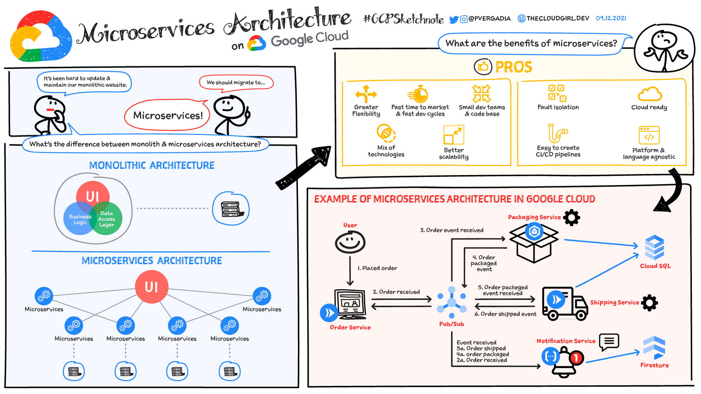

Microservices are an architectural pattern that structures an application as a collection of small, loosely coupled services that operate together to achieve a common goal. Because they work independently, they can be added, removed, or upgraded without interfering with other applications.

While there are numerous benefits to microservices architecture, like easier deployment and testing, improved productivity, flexibility, and scalability, they also pose a few disadvantages, as independently run microservices require a seamless method of communication to operate as one larger application.

Event-driven microservices allow for real-time microservices communication, enabling data to be consumed in the form of events before they’re even requested.

In this white paper, we’ll cover how event-driven microservices work, presenting a sample currency exchange platform to illustrate the design and architecture of an application composed of event-driven microservices using Apache Kafka® and Confluent Platform. We also discuss other aspects of microservices architectures, such as team structure, continuous delivery, deployment, and testing. Lastly, we discuss how Apache Kafka and Confluent Platform enable and extend core principles of microservices, including decoupling, separation of concerns, agility, and real-time streaming of event data.
